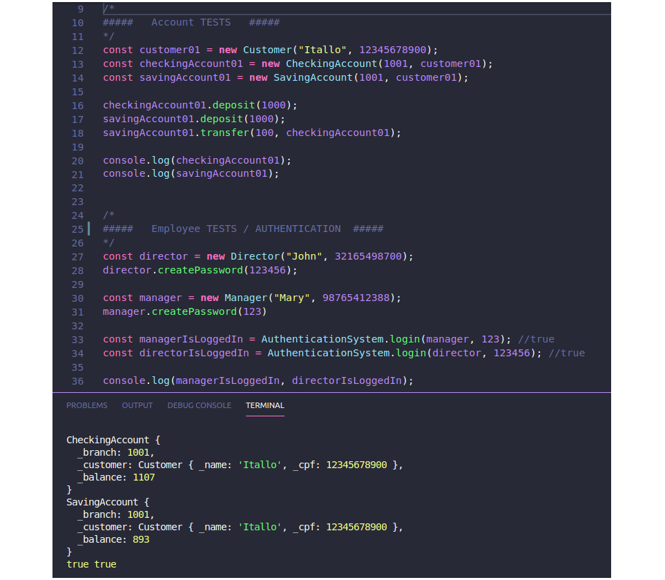

# simplebank
A simple bank operations app and an authentication system for employees With Object-oriented programming in Vanilla JS.





## Project designed to practice the following topics
* Vanilla JS
* Object Oriented Paradigm


## Reflection

The objectives of the project included using some new concepts learned to this point and familiarizing myself with this new knowledges.

I wanted to build an application with simple banking functions Iike deposit, transfer, withdraw, and a login authentication system for employees.

One of the main challenges I encountered was put into practice what I learned about the Objected-oriented Paradigm with JS. This led me to spend a few hours on research on it.

Ultimately, this project was made with only VanillaJS.


## Installation to Run Tests
Clone down this repository. You will need `node` and `npm` installed globally on your machine.  

To Run Tests:  
```sh
`npm start`  
```

